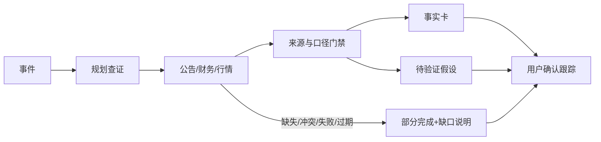

# EventLens｜评审速览

**命题回应**：设计并实现一款面向真实投资研究工作流的 AI Native 产品。选定场景为“业绩预告下修后的事件初筛”。目标用户为个人投资者和初级研究员；目标任务是快速形成带来源的事实清单、待验证影响假设和后续核查动作。

## 一屏看产品

| 问题 | 对应产品机制 | 评审可操作的证据 |
|---|---|---|
| 资料散落，结论难回溯 | 每条事实绑定证据 ID，展开看到原句、来源、发布时间、数据时点、单位与口径 | 点击事实卡 `[E1]` |
| 公告、财务、行情可能冲突 | 任务轨迹+来源校验+冲突降级 | 点击“数据冲突” |
| 外部工具会失败或返回过期数据 | 保留部分结果，显性提示失败/过期，不生成对应结论 | 点击“接口失败”“数据过期” |
| 用户看完报告后无后续动作 | 用户确认跟踪项，本地保存，可导出纪要 | “跟踪清单” → “加入跟踪” |
| 模型容易把推断写成事实 | 事实/推断/未知分层，推断附反证条件，未核验自定义材料不能成为事实 | 修改输入为自定义事件 |

## 此版本的真实完成度

- **可运行**：单页工作台、构造事件主链路、证据展开、四类故障演练、本地跟踪、纪要导出按钮、9 项行为测试。
- **可说明**：用户与工作流、AI 相对规则/搜索的增量、Agent/工具/状态设计、证据门禁、合规边界、评测设计与版本节奏。
- **待授权接入**：LLM、扶摇/iFinD 实时数据、服务端任务持久化、真实金融用户实验。当前页面和文档均明确标识构造数据。

## 衡量方式

北极星是“目标用户每周完成的有证据且经确认的有效任务数”。发布门槛先看关键事实引用覆盖 100%、重大事实错误率 <1%、工具失败透明率 100%；价值实验再看任务完成时间、跟踪项采纳率和 7 日回访率。门槛数字是**目标假设**，不是本作品实测结果。

## 阅读顺序

先操作 Web 产品 2 分钟，再读 [完整产品方案](01_产品设计说明.md)、[系统与接入规范](06_系统与数据接入规范.md)、[测试说明](03_测试说明.md)和 [AI 使用记录](04_AI使用与验证记录.md)。可选演示视频按 [120 秒脚本](05_演示脚本.md)录制。

