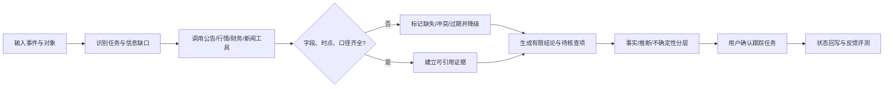

# EventLens｜事件驱动投研 Agent

> 同花顺 AIME 金融智能 Agent 产品经理笔试 · 产品设计与实现说明 · 2026-10-01

## 1. 一句话产品

面向需要快速理解上市公司事件的个人投资者和初级研究员，EventLens 将“事件输入—证据收集—影响假设—核查清单—持续跟踪”收束为一条可审计的任务链。产品不判断股价方向，不给买卖建议；它帮助用户更快找到可核查的事实、识别信息缺口，并决定下一步该查什么。

## 2. 交付范围与真实性标识

本提交包包含一个可操作的 Web MVP、源代码、README、测试说明、AI 使用与验证记录、演示脚本。演示案例中的公司、数据和链接均为**构造样例**，用于验证交互与机制，不代表真实市场信息。当前环境未提供扶摇/iFinD 凭据，故不宣称已接入实时数据。只有在来源、时点、单位、口径均齐备时，系统才允许进入“可引用事实”区；否则显示缺口与降级状态。

## 3. 用户、工作流和价值

**目标用户**：有基础证券知识、每天浏览公告或资讯、但不具备完整投研团队支持的个人投资者；也适用于初级研究员的事件初筛。典型任务是“某公司业绩预告下修后，10 分钟内弄清可证实事实、潜在传导路径及下一步核查项”。

**现有流程**：看到事件 → 搜公告 → 查历史财务/行情 → 搜同业与行业信息 → 在笔记里写可能原因 → 过几天重复搜索。信息分散、口径不一、观点容易越过证据、后续跟踪容易遗忘。

**价值假设**：相比用户在多个页面间手动复制，结构化任务链可缩短形成“有引用的初步分析”的时间；通过事实与推断分层、缺失显性化和人工确认，降低无依据结论比例。价值以受试者任务实验验证，而不是凭 Demo 声称。

**非目标**：自动交易、个股涨跌预测、收益承诺、投资适当性判断、覆盖所有市场事件、替代研究员签署正式报告。

## 4. 为什么需要 LLM / Agent

规则适合校验字段、时效、引用完整度和风险词；搜索适合找到原文；数据产品适合展示指标。困难在于事件表述不固定、一个事件涉及多来源与多轮核查、证据可能冲突。LLM 可将非结构化原文抽取成可校验的主张，Agent 可按任务状态规划下一步工具调用，在失败时重试/降级，在证据变化后更新假设。规则仍作为结论发布门禁，不能由模型绕过。

| 环节 | 确定性机制 | LLM/Agent 增量 | 人的决策 |
|---|---|---|---|
| 事件理解 | 股票/日期/数字解析 | 识别事件类型、主体和待查问题 | 修正事件含义 |
| 证据采集 | API 查询、去重、时间校验 | 根据缺口选择下一工具 | 选择可信来源 |
| 影响分析 | 口径计算、引用校验 | 生成“事实→机制→条件”的假设 | 接受/驳回假设 |
| 持续跟踪 | 阈值、状态、提醒 | 根据新证据建议核查项 | 确认跟踪任务 |

## 5. MVP 主链路

**输入**：事件文本，选填证券对象与关注点。**输出**：事件摘要、证据卡、影响链、尚未证实的假设、风险与缺口、跟踪清单、运行轨迹。**状态**：待执行、采集中、证据校验中、可审阅、降级完成、失败；每一阶段有可重试入口与原因。

## 6. 数据和工具契约

| 工具能力 | 首选来源 | 输入 | 最低输出字段 | 失败处理 |
|---|---|---|---|---|
| 公告/原文检索 | 扶摇或经授权的公告源 | 证券、日期、关键词 | 标题、原文链接、发布时间、原句、来源 ID | 无原文则不产生公告事实 |
| 行情快照/K 线 | 扶摇 | 证券、交易日 | 时间、价格/涨跌幅、单位、复权与交易日口径 | 过期或缺失时只展示“未取得” |
| 财务指标 | 扶摇/iFinD | 证券、报告期、指标 | 值、单位、报告期、披露日、是否调整 | 不同口径并列展示，禁止直接比较 |
| 新闻/政策 | iFinD MCP | 关键词、时间窗 | 原文、来源、发布时间、URL、主题 | 未授权或失败时跳过此证据类别 |

具体工具名称、参数及许可约束应以接入时的实际文档和返回为准；本版本没有把题目给出的文档 URL 推断为已验证的接口。每条证据保存 `source_id/source_url/published_at/as_of/unit/basis/raw_excerpt/retrieved_at`。LLM 只可引用已有 `source_id`，前端以校验器拒绝“无来源事实”。

## 7. Agent 编排与答案契约

任务对象包含 `task_id, input, plan, tool_runs, evidence, claims, hypotheses, watch_items, status, errors, feedback`。规划器先确定必需的证据槽：事件原文、历史基线、市场反应、同业/外部因素。工具调用按依赖执行；独立查询可并行。结果聚合时先做实体、期间、单位、币种、是否追溯调整校验，再交给模型生成假设。

模型输出使用结构化 JSON：`claim_type` 只能是 `fact/inference/unknown`；事实必须有至少一个存在且时点合格的 `evidence_id`；推断必须写明机制和反证条件；未知项必须写明下一步可核查来源。模型温度低，禁止生成价格目标或交易动作。若 JSON 无法解析、引用不存在、数值与原字段不一致，进入修复一次；再次失败则降级为证据清单和待核查问题。

**长任务恢复**：以任务 ID 保存阶段和已成功工具结果；超时后从未完成节点恢复，幂等工具避免重复调用；单工具指数退避最多两次；超过限额转为“部分完成”。上下文过长时只保留去重后的证据片段与来源索引，完整原文仍可按 ID 回查。二次反思针对“证据是否支持主张、是否遗漏反证、是否混淆时间/单位”，不能凭模型自信分数发布结论。

## 8. 可交互设计

首屏直接是任务工作台：左侧输入与场景按钮，中部事件结论和证据链，右侧任务轨迹与跟踪清单。视觉用深蓝色信息面板和琥珀色待核查标识，数字/来源/时间保持高对比。点击证据可看到原始字段；点击影响假设可查看所依赖的证据与反证条件。故障模拟器用于展示“数据缺失、接口失败、证据冲突”，并触发对应的降级说明。

## 9. 衡量价值与验证设计

**北极星指标**：`有证据且经用户确认的有效任务数 / 目标用户周`。有效任务需满足：任务完成、核心事实引用覆盖率 100%、无重大事实错误、至少一个用户确认的核查动作。

| 层级 | 指标 | 计算与目标（试点假设，非现有成绩） |
|---|---|---|
| 质量 | 关键事实引用覆盖率 | 有效引用的关键事实/关键事实；试点门槛 100% |
| 质量 | 重大事实错误率 | 被人工复核判错的关键事实/抽检关键事实；目标 <1% |
| 可靠性 | 端到端有效完成率 | 符合有效任务门槛的任务/开始任务；第 1 轮目标 ≥70% |
| 可靠性 | 工具失败透明率 | 已向用户展示失败原因的失败调用/全部失败调用；目标 100% |
| 效率 | 首份可审阅结果时间 | 输入到证据卡可审阅的 P50/P90；试点对照人工流程 |
| 价值 | 用户采纳率 | 被确认并留存的跟踪项/建议跟踪项；试点目标 ≥30% |
| 留存 | 7 日任务回访率 | 7 日内重访跟踪任务的用户/创建任务用户 |

**实验**：招募 12–20 位目标用户，以同一组已封存的事件材料做交叉实验（人工搜索/原有工具 vs EventLens），任务顺序随机。记录完成时间、事实引用合规、重大错误、任务理解度及主观信任；由两名具证券研究背景的评审盲审，分歧复核。以用例为单位分析，避免只看平均值。先做 30–50 个离线金标事件评测，再做小流量灰度，达到质量门槛后扩展场景。

## 10. 失效与合规边界

数据缺失：保留空槽并给出下一步来源；接口失败：显示工具和时间，允许重试；来源冲突：并排展示原值、期间、口径并暂停综合数值结论；过期：打“历史数据”标识；幻觉：无引用事实拦截；越界提问：拒绝确定性预测、收益承诺和直接买卖指令，转为情景条件与风险因素。日志去标识化，不记录密钥、真实持仓、手机号。持仓示例只使用构造数据。正式接入前需与法务/合规核对数据授权、转载、留存及投顾边界。

## 11. 版本节奏

**V0（本作业）**：单事件工作台、可复现样例、证据展开、故障注入、跟踪项确认、评测面板；展示产品机制。**V1（4–6 周）**：接入经授权的公告/行情/财务接口，结构化输出校验、任务状态持久化、离线金标评测。**V2（8–12 周）**：多事件持续监控、记忆偏好、跨标的比较、人工反馈回流；前提是 V1 达到事实与稳定性门槛。

## 12. 评审可追问的取舍

选择业绩预告下修，因为它通常有明确公告、可量化历史基线、可核查的经营解释以及后续财报验证点。MVP 只覆盖“辅助研究”，不把多个 Agent 人设堆进界面。状态机和证据门禁是优先级最高的产品机制；模型换代可以提升语言理解，但不能替代来源校验和失败提示。

