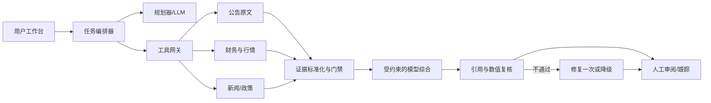
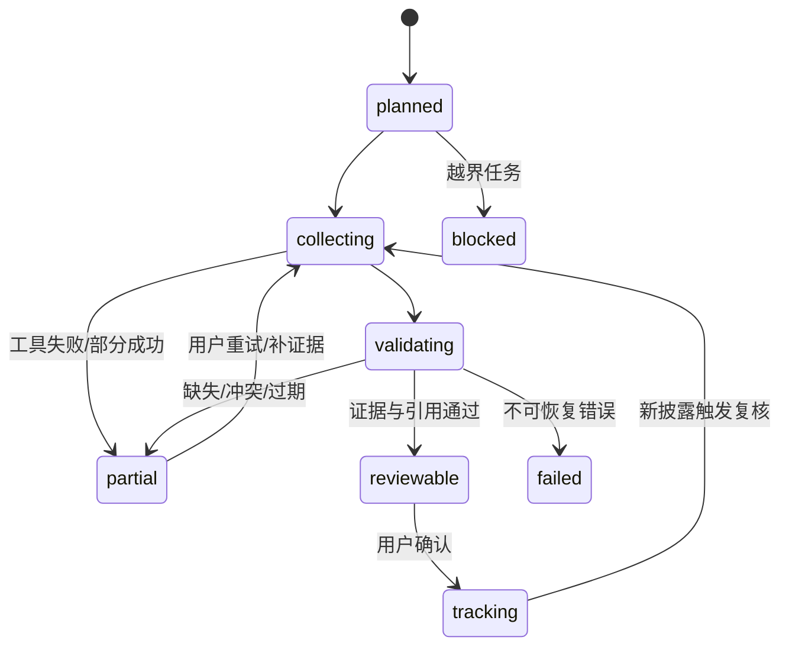

# 系统与数据接入规范

此文档给出从当前构造数据 MVP 升级到真实金融 Agent 的可执行契约。具体供应商工具名和参数需在取得授权后核对，当前没有把候选数据源描述成已接入服务。

## 1. 系统边界



前端不持有供应商密钥。服务端工具网关负责鉴权、限流、超时、审计与数据许可控制。模型只处理最小必要证据片段，不能自行访问未经授权网页。证据原文应保留受控引用，不把有版权限制的内容公开复制进仓库。

## 2. 任务与证据数据模型

```json
{
  "task_id": "task_xxx",
  "status": "collecting | validating | reviewable | partial | blocked | failed",
  "input": { "event_text": "...", "security": "...", "as_of": "..." },
  "plan": [{ "step_id": "announcement", "tool": "provider_announcements", "depends_on": [] }],
  "tool_runs": [{ "step_id": "announcement", "status": "success | failed", "latency_ms": 0, "error_code": null }],
  "evidence": [{
    "evidence_id": "E1", "source_id": "...", "source_url": "https://...",
    "published_at": "ISO-8601", "retrieved_at": "ISO-8601", "as_of": "报告期或交易日",
    "unit": "亿元", "basis": "归母净利润/预告区间/非审计数",
    "raw_excerpt": "...", "verification_status": "verified | stale | conflicting | missing"
  }],
  "claims": [{ "type": "fact | inference | unknown", "text": "...", "evidence_ids": ["E1"], "falsifier": "..." }],
  "watch_items": [{ "title": "...", "source_hint": "...", "confirmed_by_user": false }]
}
```

**不可省略的校验**：实体匹配、发布时间和数据时点、报告期间、币种与单位、归母/扣非/营收等指标口径、是否审计或追溯调整、原文片段与数值一致、引用 ID 存在。事实引用可能跨多个来源；来源冲突时不得简单投票求均值。

## 3. 工具调用策略

| 阶段 | 输入 | 工具策略 | 出错后 |
|---|---|---|---|
| 识别 | 事件文本 | 提取证券主体、事件类型、日期与用户目标 | 实体歧义则请用户确认，不查错对象 |
| 原文 | 主体+日期窗 | 优先官方公告或经授权原文 | 缺失即关闭事实卡门禁 |
| 基线 | 同期间历史财务与前次预告 | 同指标同口径比较 | 口径冲突并列展示 |
| 市场 | 对应交易日+同业/指数 | 时间戳和交易日历校验 | 超时重试至多 2 次，再部分完成 |
| 外因 | 行业、宏观、新闻/政策 | 标注发布时间和样本窗口 | 未授权/低可信来源不进入事实结论 |
| 综合 | 标准化证据片段 | 模型生成结构化主张与反证 | JSON 不合法修复一次，仍失败则降级 |

工具应返回统一错误码，例如 `AUTH_REQUIRED`, `RATE_LIMITED`, `TIMEOUT`, `NO_RESULT`, `SCHEMA_MISMATCH`, `STALE_DATA`, `CONFLICTING_SOURCE`。轨迹保存 `request_id`、调用时间、持续时长、错误码和重试次数，避免把异常包装成“未见异常”。

## 4. LLM 输出约束

建议两段式调用。第一段从原文提取事件字段并产出证据定位，不写投资结论；第二段只基于已通过门禁的证据生成“事实/推断/未知”结构化 JSON。每条事实带证据 ID；每条推断带机制、前提、反证条件与不确定性。模型的自然语言置信度不作为安全阈值。引用、数值、单位和禁止内容由程序复核后发布。

若用户问“明天会涨多少/现在应买入吗”，返回风险因素和可验证信息，不输出确定性价格路径或交易动作。若存在真实个人持仓，需有明确授权、最小化传输和访问日志隔离；本作业不处理持仓。

## 5. Agent 状态机



每次恢复从已完成且仍有效的工具节点继续；任务 ID 与步骤 ID 构成幂等键。模型上下文只保存摘要和证据索引，完整原文按权限回查。对话记忆只保留用户明确选择的研究偏好，不把曾经的假设当成未来事实。

## 6. 评测与发布门槛

离线金标集至少覆盖：业绩修正、财报披露、政策冲击、行业事件、新闻误报、停牌、交易日错位、单位错配、公告更正、来源冲突。每个样本标注实体、关键事实、正确引用、不得推出的结论和应提示的缺口。关键事实错误由两名评审复核。

上线门槛建议：关键事实引用覆盖 100%，重大事实错误率 <1%，失败透明率 100%；端到端有效完成率 ≥70% 作为首轮优化目标。以上均为**目标，不是本作品实测成绩**。需同时按工具、事件类型、模型版本、数据源分层看误差，防止平均值掩盖高风险场景。

## 7. 接入清单

1. 确认扶摇/iFinD 实际可调用工具、字段、速率、数据许可、缓存和引用规则。
2. 服务端配置供应商凭据与模型密钥，分环境隔离；前端只拿任务结果和可公开引用。
3. 用真实返回建立字段映射与样例回放，先完成一条事件主链路。
4. 逐项注入超时、空值、冲突、过期、错误 JSON，检查状态机和 UI。
5. 建立离线金标与用户实验后，再扩大股票和事件范围。

